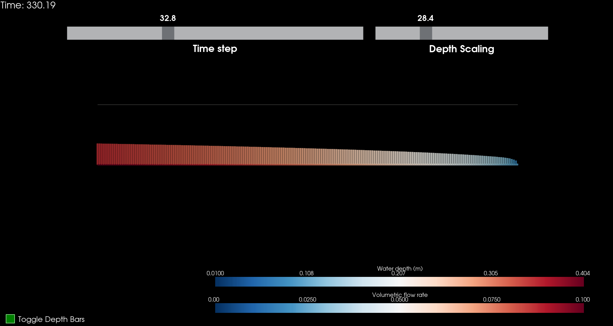
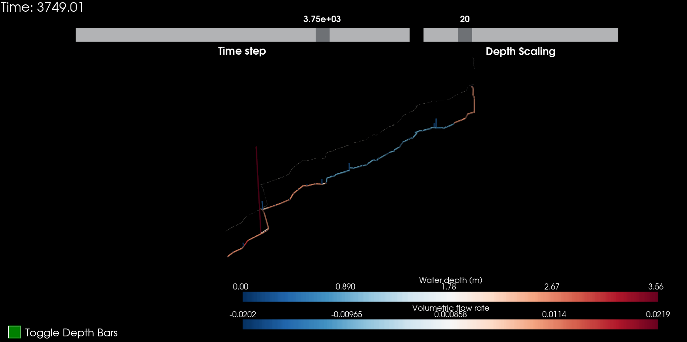
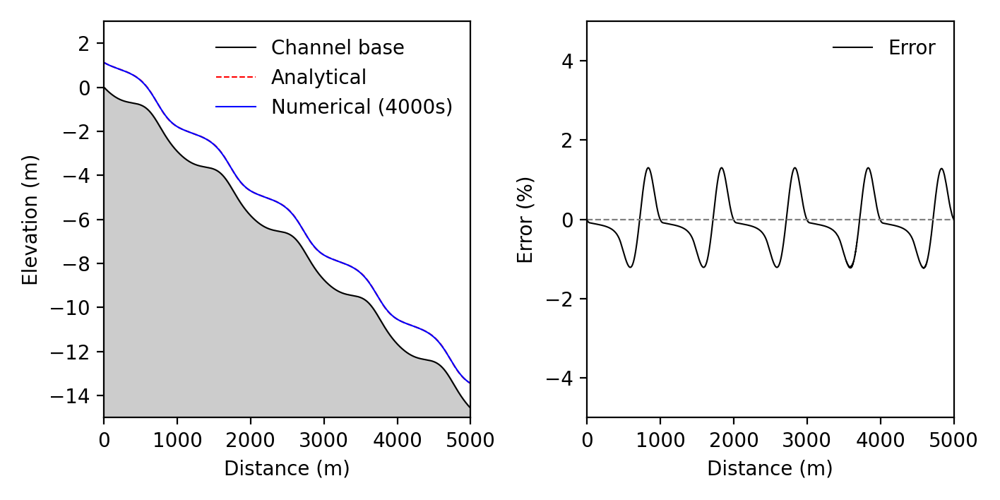

# Examples
    
After cloning all examples can be found in 'src/openkarst/examples' and can be run from there. The main.py in 'src/openkarst' by default comes with the content of Example 1. To run any of the examples or the main script, navigate to 'src/openkarst' or 'src/openkarst/examples' and use the python commands shown below. Alternatively use your preferred Python IDE (Spyder, PyCharm, VSCode) and run the main files.

```bash

python main.py

```

or

```bash

python main_example1.py

```

## Example 1: Basic setup

The first example simulates flow along a linear conduit network with a constant inflow condition and a constant water depths boundary. Note that in order create movies via the PyVista animation function FFMPEG is required. Replace the directory with your location or properly set up your path. I failed to do so on my Mac in a virtual python environment ;)

```python

import os
import openpnm as op
import numpy as np

# Needs pip install imageio-ffmpeg or directly point to your FFMPEG location
os.environ["IMAGEIO_FFMPEG_EXE"] = "/Users/jkordil_idaea/Downloads/ffmpeg" 

from openkarst.network_generation import compute_conduit_lengths
from openkarst.visualization.animation_pyvista import animate_network
from openkarst.models import FlowSimulation
```

Defining the simulation settings via dictionaries. Note that the order of settings does not matter and missing ones will be replaced by default values.

```python

def main():
    
    # Setup flow simulation parameters
    physical_properties = {
        'water_density': 1000,        # kg/m^3
        'gravity': 9.81,              # m/s^2
        'dynamic_viscosity': 0.001,   # Pa.s (kg/m.s)
        'geometry_channel': False,    # Channel geometry for analytical solutions (Default False)
        'channel_type': 'infinite',   # 'infinite' for infinitely wide channel, 'finite' for defined width
        'channel_width': 1.0,         # Width of the channel (only used if channel_type is 'finite')
    }
    
    solver_settings = {
        'relaxation_factor': 0.6,    # Dimensionless
        'max_iterations': 20,        # Maximum Picard iterations
        'picard_depth_tol': 1e-7,    # Picard depth tolerance (meters)
        'ss_rel_l2tol': 1e-7,        # L2 tolerance for steady-state
    }
    
    simulation_settings = {
        'min_waterdepth': 1e-10,      # Minimum water depth (meters)
        'min_flowrate': 1e-10,        # Minimum flow rate (m^3/s)
        'courant': 0.8,               # Courant number
        'adaptive_timesteps': True,   # Use adaptive timestepping
        'dt_init': 0.001,             # Initial (or constant) timestep (seconds)
        'dt_max': 1.0,                # Maximum allowable time step
        'steady_state': False,         # Steady-state (True) or transient (False)
        't_max': 1000.0,              # Maximum time for transient simulations (seconds)
        'print_info_interval': 1000,     # Print info every # time steps
    }
    
    output_settings = {
        'output_interval': 10.0,
        'time': True,
        'time_step_size': True,
        'flowrates': True,
        'water_depths': True,
        'l2_norms': True,
        'convergence_fails': True,
        'reynolds_numbers': True,
    }
    
    logging_settings = {
        'base_dir': os.path.dirname(os.path.abspath(__file__)),
        'log_file': 'simulation.log'
    }
```

Now we define a simple 1D network object called cn_geometry and its geometry using the openPNM functionality. The network consists of 200 nodes in X direction with a spacing of 1m. Note that in openPNM all properties are assigned to either throat (conduit) or pore (node). As we currently import openPNM the assignment of properties to either conduits or nodes needs to follow the naming convention (throat.propertyX, pore.propertyY).

We compute the node distances (i.e. conduit lengths) and assign them to a new network object property "throat.lengths". The (constant) diameters and roughness of the conduits are assigned to the network object as "throat.diameters" and "throat.epsilon".

```python
    # Create network object using OpenPNM
    dl = 1 # Constant spacing between nodes (meters)
    cn_geometry = op.network.Cubic(shape=[200, 1, 1], connectivity=6, spacing=dl)
    
    # Compute conduit lengths using the utility function
    cn_geometry = compute_conduit_lengths(cn_geometry)
    
    # Assign conduit properties
    cn_geometry['throat.epsilon'] = 0.03
    cn_geometry['throat.diameters'] = 1.0
```

Next we create the object flow_network via the FlowSimulation class and set the initial conditions at all nodes and conduits. The FlowSimulation class takes the settings for physical properties, solver settings and simulation settings during creation of the network object. Output settings are directly passed to the run_simulation method of the flow_network object afterwards.

We set constant initial conditions at all nodes and conduits. Note that again the internal openPNM naming convention yields Nt (number of all throats, i.e. conduits) and Np (number of all pores, i.e. nodes) that can be accessed via the geometry object cn_geometry.

```python
# Create flow network object
    flow_network = FlowSimulation(cn_geometry,
                                  physical_properties = physical_properties,
                                  solver_settings = solver_settings,
                                  simulation_settings = simulation_settings,
                                  logging_settings = logging_settings)
    
    # Set initial conditions
    initial_Q = np.full(cn_geometry.Nt, 0.0, dtype=float)   # Initial flows at each conduit (Nt throats)
    initial_y = np.full(cn_geometry.Np, 0.01, dtype=float)  # Initial water depths at each node (Np pores)    
    flow_network.set_initial_conditions(initial_Q, initial_y)
```

Now we set proper boundary conditions, in this case a constant inflow rate at the left side and a constant water depths at the right side. Note that the indexing of nodes starts at zero. Both boundaries receive dictionaries of nodes and associated values (flow rates or depths).

```python
# Set boundary conditions
    right_nodes = [199]
    left_nodes = [0]
    
    flowrate  = 0.1     # Flowrate in m^3/s
    water_depth = 0.01  # Water depths in m
    
    inflow_boundary_left = {node: flowrate for node in left_nodes}
    waterdepth_boundary_right = {node: water_depth for node in right_nodes}
    
    flow_network.set_boundary_conditions(inflow_boundary = inflow_boundary_left)
    flow_network.set_boundary_conditions(waterdepth_boundary = waterdepth_boundary_right)
```

Finally we call the run_simulation method to start the simulation and pass the desired output settings. To visualize the results we extract the required arrays from the results container and pass them to the animate_network function

```python
 # Run simulation and store results
    results = flow_network.run_simulation(desired_outputs = output_settings)
    
    # Get arrays from results container
    Q_history = results['flowrates']
    y_history = results['water_depths']
    t_history = results['time']
    
    
    animation_settings = {
        'update_interval': 1,
        'conduit_plotradius': 0.5,
        'bar_plotradius': 0.5,
        'node_plotsize': 5,
        'depthscaling': 20,
        'fig_width': 1600,
        'fig_height': 800,
        'zoom_factor': 1.0,
        'background_color': 'black',
        'isometric_view': False,
        'create_animation': False,
        'filename': "network_animation2.mp4"
    }
    
    animate_network(cn_geometry=cn_geometry, 
                    Q_history=Q_history, 
                    y_history=y_history, 
                    t_history=t_history, 
                    **animation_settings)
                    
    return results

if __name__ == '__main__':
    results = main()
```



## Example 2: Import of a cave network

In this example we import a karst cave network using the new project cave format.

```python

import os
import numpy as np
import matplotlib.pyplot as plt
import networkx as nx

# Needs pip install imageio-ffmpeg
os.environ["IMAGEIO_FFMPEG_EXE"] = "/Users/jkordil_idaea/Downloads/ffmpeg" 

from openkarst.io.cave_data_loader import CaveDataLoader
from openkarst.models import FlowSimulation
from openkarst.visualization.animation_pyvista import animate_network


def main():
    
    # Setup flow simulation parameters
    physical_properties = {
        'water_density': 1000,        # kg/m^3
        'gravity': 9.81,              # m/s^2
        'dynamic_viscosity': 0.001,   # Pa.s (kg/m.s)
        'geometry_channel': False,    # Channel geometry for analytical solutions (Default False)
        'channel_type': 'infinite',   # 'infinite' for infinitely wide channel, 'finite' for defined width
        'channel_width': 1.0,         # Width of the channel (only used if channel_type is 'finite')
    }
    
    solver_settings = {
        'relaxation_factor': 0.6,    # Dimensionless
        'max_iterations': 20,        # Maximum Picard iterations
        'picard_depth_tol': 1e-4,    # Picard depth tolerance (meters)
        'ss_rel_l2tol': 1e-7,        # L2 tolerance for steady-state
    }
    
    simulation_settings = {
        'min_waterdepth': 1e-12,      # Minimum water depth (meters)
        'min_flowrate': 1e-12,        # Minimum flow rate (m^3/s)
        'courant': 0.8,               # Courant number
        'adaptive_timesteps': True,   # Use adaptive timestepping
        'dt_init': 0.0001,             # Initial (or constant) timestep (seconds)
        'dt_max': 0.1,                # Maximum allowable time step
        'steady_state': False,         # Steady-state (True) or transient (False)
        't_max': 2000.0,              # Maximum time for transient simulations (seconds)
        'print_info_interval': 1000,     # Print info every # time steps
    }
    
    output_settings = {
        'output_interval': 1.0,
        'time': True,
        'time_step_size': True,
        'flowrates': True,
        'water_depths': True,
        'l2_norms': True,
        'convergence_fails': True,
        'reynolds_numbers': True,
    }
    
        logging_settings = {
        'base_dir': os.path.dirname(os.path.abspath(__file__)),
        'log_file': 'simulation.log'
    }
```

We now use the CaveDataLoader class to create a loader object. We pass the file paths of nodes, edges and diameters to the loader object method load_cave_dat(). This will create a networkX graph, generate an openPNM geometry object, assign the diameters to the conduits, and return the openPNM geometry object. We then also assign a constant roughness value to all conduits. Notice the relative import of cave data from the parent folder openkarst/cave_data.

```python

    # Get the directory of the current script
    current_dir = os.path.dirname(os.path.abspath(__file__))

    # Construct the full path to the nodes and conduit files
    nodes_file_path = os.path.join(current_dir, '../cave_data/reve_eveille/nodes.csv')
    edges_file_path = os.path.join(current_dir, '../cave_data/reve_eveille/edges.csv')
    diameters_file_path = os.path.join(current_dir, '../cave_data/reve_eveille/diameters.csv')

    # Initialize CaveDataLoader and load data
    loader = CaveDataLoader(nodes_file_path, edges_file_path, diameters_file_path)
    cn_geometry = loader.load_cave_data()
  
    # Assign conduit properties
    cn_geometry['throat.epsilon'] = 0.03
```
As in [Example 1](#example-1-basic-setup) we use the FlowSimulation class to create a flow_network object and pass the geometry object, physical properties, solver settings and simulations settings to it. We also set initial conditions for flow rates and water depths.

```python

# Create flow network object
    flow_network = FlowSimulation(cn_geometry,
                                  physical_properties = physical_properties,
                                  solver_settings = solver_settings,
                                  simulation_settings = simulation_settings,
                                  logging_settings = logging_settings)
    
    # Set initial conditions
    initial_Q = np.full(cn_geometry.Nt, 0.0, dtype=float)   # Initial flows at each conduit (Nt throats)
    initial_y = np.full(cn_geometry.Np, 0.01, dtype=float)  # Initial water depths at each node (Np pores)    
    flow_network.set_initial_conditions(initial_Q, initial_y)    
```

Now we set the boundary conditions for the inflow node (constant flow rate) and outlet node (constant water depths). Note that these have been chosen by inspecting the cave network data. In principle node numbers can also be determined from the information stored in the openPNM geometry object, e.g., finding the highest/lowest node, or nodes with coordination number 1.

```python

# Set boundary conditions
    outflow_nodes = [21]
    inflow_nodes = [71]
    
    flowrate  = 0.01     # Flowrate in m^3/s
    water_depth = 0.01  # Water depths in m
    
    inflow_boundary_left = {node: flowrate for node in inflow_nodes}
    waterdepth_boundary_right = {node: water_depth for node in outflow_nodes}
    
    flow_network.set_boundary_conditions(inflow_boundary = inflow_boundary_left)
    flow_network.set_boundary_conditions(waterdepth_boundary = waterdepth_boundary_right)
```

We then call the run_simulation method to start the simulation and pass the desired output settings. As in the previous example we extract the required arrays from the results container and pass them to the animate_network function. In addition we also return the results container and the openPNM geometry object (cn_geometry) from the main() function for further plotting (here for example the outflow at the outlet conduit) and easier access in a variable explorer of your IDE.

```python

 # Run simulation and store results
    results = flow_network.run_simulation(desired_outputs = output_settings)
    
    # Get arrays from results container
    Q_history = results['flowrates']
    y_history = results['water_depths']
    t_history = results['time']
    
    
    animation_settings = {
        'update_interval': 1,
        'conduit_plotradius': 0.5,
        'bar_plotradius': 0.5,
        'node_plotsize': 5,
        'depthscaling': 20,
        'fig_width': 1600,
        'fig_height': 800,
        'zoom_factor': 1.0,
        'background_color': 'black',
        'isometric_view': False,
        'create_animation': False,
        'filename': "network_animation2.mp4"
    }
    
    animate_network(cn_geometry=cn_geometry, 
                    Q_history=Q_history, 
                    y_history=y_history, 
                    t_history=t_history, 
                    **animation_settings)
    
    return results, cn_geometry

if __name__ == '__main__':
    results, cn_geometry = main()
    
# Get arrays from results container
Q_history = results['flowrates']
y_history = results['water_depths']
t_history = results['time']

# Extract flow rates at node 21
node_id = 21
connected_throats = cn_geometry.find_neighbor_throats(pores=[node_id])
flowrates_at_node = Q_history[:, connected_throats]
total_flowrates_at_node = np.sum(flowrates_at_node, axis=1)

# Plot the outflow at the conduit connected to the boundary node
plt.figure()
plt.plot(t_history, total_flowrates_at_node, label=f'Node {node_id}')
plt.xlabel('Time (s)')
plt.ylabel('Flowrate (m^3/s)')
plt.title(f'Flowrate at Node {node_id} Over Time')
plt.legend()
plt.show()
```



## Example 3: Comparison with analytical solution

In this example we compare the model with an analytical solution for steady-state 1D flow in a wide open channel ([Delestre, 2010](https://theses.hal.science/tel-00531377v1)). In contrast to the previous examples we do not consider a conduit geometry but an infinitely wide channel (i.e. we neglect friction along the lateral boundaries such that the hydraulic radius is only a function of the flow depth). The channel_width parameter could be omitted when an infinite channel is considered. Instead of computing an equivalent Manning roughness from the epsilon roughness height we directly apply the Manning roughness to all channel segments via the channel_manning parameter. 

```python

import os
import openpnm as op
import numpy as np
import matplotlib.pyplot as plt
from matplotlib.collections import LineCollection
from matplotlib.lines import Line2D
import matplotlib.animation as animation
from scipy.interpolate import interp1d
from scipy.integrate import odeint

# Needs pip install imageio-ffmpeg
os.environ["IMAGEIO_FFMPEG_EXE"] = "/Users/jkordil_idaea/Downloads/ffmpeg" 

from openkarst.network_generation import compute_conduit_lengths
from openkarst.visualization.animation_pyvista import animate_network
from openkarst.models import FlowSimulation


def main():
    
    # Setup flow simulation parameters
    physical_properties = {
        'water_density': 1000,        # kg/m^3
        'gravity': 9.81,              # m/s^2
        'dynamic_viscosity': 0.001,   # Pa.s (kg/m.s)
        'geometry_channel': True,     # Channel geometry for analytical solutions (Default False)
        'channel_type': 'infinite',   # 'infinite' for infinitely wide channel, 'finite' for defined width
        'channel_width': 0.12,        # Width of the channel (only used if channel_type is 'finite')
        'channel_manning': 0.03,      # Constant Manning roughness applied to all channel segments
    }
    
    solver_settings = {
        'relaxation_factor': 0.6,    # Dimensionless
        'max_iterations': 20,        # Maximum Picard iterations
        'picard_depth_tol': 1e-5,    # Picard depth tolerance (meters)
        'ss_rel_l2tol': 1e-7,        # L2 tolerance for steady-state
    }
    
    simulation_settings = {
        'min_waterdepth': 1e-10,      # Minimum water depth (meters)
        'min_flowrate': 1e-10,        # Minimum flow rate (m^3/s)
        'courant': 0.8,               # Courant number
        'adaptive_timesteps': True,   # Use adaptive timestepping
        'dt_init': 0.001,             # Initial (or constant) timestep (seconds)
        'dt_max': 1.0,                # Maximum allowable time step
        'steady_state': False,        # Steady-state (True) or transient (False)
        't_max': 4000.0,              # Maximum time for transient simulations (seconds)
        'print_info_interval': 100,   # Print info every # time steps
    }
    
    output_settings = {
        'output_interval': 10.0,
        'time': True,
        'time_step_size': True,
        'flowrates': True,
        'water_depths': True,
        'l2_norms': True,
        'convergence_fails': True,
        'reynolds_numbers': True,
    }
    
        logging_settings = {
        'base_dir': os.path.dirname(os.path.abspath(__file__)),
        'log_file': 'simulation.log'
    }
```

First we create the geometry object, a 5000m long channel with a node spacing of 1m. Notice that we do not explicitly pass the conduit diameters to the geometry object as they are not required for the open channel flow.

```python
# Create network object using OpenPNM
    dl = 1 # Constant spacing between nodes (meters)
    cn_geometry = op.network.Cubic(shape=[5000, 1, 1], connectivity=6, spacing=dl)
    
    # Compute conduit lengths using the utility function
    cn_geometry = compute_conduit_lengths(cn_geometry)

```

Next we compute the height field z for the channel base for a given water height. We then assign the height information z to the third dimension of the pore.coords property of the geometry object.

```python

# Create a height field according to the analytical steady-state solution (3.3.1.9) from:
    # Delestre, O. (2010): Simulation du ruissellement d’eau de pluie sur des surfaces agricoles.
    # Mathématiques. Université d’Orléans
    # https://theses.hal.science/tel-00531377v1

    # Parameters
    x = np.linspace(0, 5000, 5000)
    g = 9.81  # gravity (m/s^2)
    q = 2     # flow rate (m^2/s)
    n = 0.03  # Manning's roughness coefficient
    water_height = 9/8 +  1/4 * np.sin(np.pi * x / 500)
    
    # ODE function
    def dz_dx(z, x):
        h = h_interp(x)
        # Derivative from Delestre (2010)
        dh_dx = (np.pi / 2000) * np.cos(np.pi * x / 500)
        return (q**2 / (g * h**3) - 1) * dh_dx - Sf(h)
    
    # Friction slope function
    def Sf(h):
        return n**2 * q * np.abs(q) / (h**(10/3))
    # Interpolate h(x) for the ODE function
    h_interp = interp1d(x, water_height, kind='cubic', fill_value="extrapolate")
    
    # Initial condition for z
    z0 = [0]  # Bed elevation starts at 0
    
    # Solve the ODE with the given dh/dx
    z = odeint(dz_dx, z0, x).flatten()
    
    # Assign the heights of the channel to the z-dimension of the geometry object
    cn_geometry['pore.coords'][:, 2] = z

```

Finally we create a FlowSimulation object and set the initial conditions (no flows, empty channel). We also set the inflow boundary at the left side and the constant water depth boundary at the right side (computed from the analytical solution). 

```python

# Create flow network object
    flow_network = FlowSimulation(cn_geometry,
                                  physical_properties = physical_properties,
                                  solver_settings = solver_settings,
                                  simulation_settings = simulation_settings,
                                  logging_settings = logging_settings)
    
    # Set initial conditions
    initial_Q = np.full(cn_geometry.Nt, 0.0, dtype=float)   # Initial flows at each conduit (Nt throats)
    initial_y = np.full(cn_geometry.Np, 0.0, dtype=float)  # Initial water depths at each node (Np pores)    
    flow_network.set_initial_conditions(initial_Q, initial_y)
      
    inflow_boundary_left = {0: 2.0} # Flowrate in m^2/s at node 0
    waterdepth_boundary_right = {4999: water_height[4999]}
    
    flow_network.set_boundary_conditions(inflow_boundary = inflow_boundary_left)
    flow_network.set_boundary_conditions(waterdepth_boundary = waterdepth_boundary_right)
    
    # Run simulation and store results
    results = flow_network.run_simulation(desired_outputs = output_settings)
    
    return cn_geometry, results, water_height
```

In the following we obtain the geometry object, the results container and the analytical water height from the main function and animate the transient dynamics until steady-state is reached. Note the hardcoded ffmpeg path that you need to modify on your system. We also modify the current directory to save video and figure to the current directory where the example is run.

```python


if __name__ == '__main__':
    
    script_dir = os.path.dirname(os.path.abspath(__file__))
    os.chdir(script_dir)
    
    cn_geometry, results, water_height = main()
    
######################################################################
############## Animation of solution ######################################
######################################################################

# Get arrays from results container
Q_history = results['flowrates']
y_history = results['water_depths']
t_history = results['time']

# Compute hydraulic head    
H_history = cn_geometry['pore.coords'][:, 2] + y_history

plt.rcParams['font.size'] = 10

width_cm = 18
height_cm = 10
width_in = width_cm / 2.54
height_in = height_cm / 2.54

fig, ax = plt.subplots(figsize=(width_in, height_in))
distances = np.arange(len(H_history[0]))
lc = LineCollection([], colors='blue', lw=1)  # Empty line collection
ax.add_collection(lc)  # Add the collection to the axes

def init():
    ax.set_xlim(0, 5000)
    ymin, ymax = -15.0, 3.0
    ax.set_ylim(ymin, ymax)
    
    base = cn_geometry['pore.coords'][:, 2]
    
    # Draw the static and analytical lines first with a lower zorder
    ax.plot(distances, base, color='black', lw=0.8, zorder=1)
    ax.plot(distances, base + water_height, color='red', lw=0.8, linestyle='dotted', zorder=2)
    ax.fill_between(distances, ymin, base, color=(0.8, 0.8, 0.8), zorder=0)
    
    # Proxy element for the numerical solution
    numerical_line = Line2D([0], [0], color='blue', lw=1, label='Numerical solution')
    
    # Add all legend entries
    legend_entries = [
        Line2D([0], [0], color='black', lw=0.8, label='Static boundary'),
        Line2D([0], [0], color='red', lw=0.8, linestyle='dotted', label='Analytical solution'),
        Line2D([0], [0], color='blue', lw=0.8, label='Numerical solution')
    ]

    # Set axis labels
    ax.set_xlabel('Distance (m)')
    ax.set_ylabel('Elevation (m)')

    # Add the legend without the box
    ax.legend(handles=legend_entries, loc='upper right', frameon=False)
    return [lc]

def update(frame):
    head = H_history[frame]
    points = np.array([distances, head]).T.reshape(-1, 1, 2)
    segments = np.concatenate([points[:-1], points[1:]], axis=1)
    lc.set_segments(segments)
    lc.set_zorder(3)  # Ensure the blue line is on top
    ax.set_title(f'Time: {t_history[frame]:.1f} (s)')
    return [lc]

update_interval = 1 # plot every x steps
ani = animation.FuncAnimation(fig,
                              update, 
                              frames=range(0, len(H_history), 
                              update_interval),
                              init_func=init,
                              blit=False,
                              repeat=False)

# Hardcoded ffmpeg path, replace with your own path or correctly set up the python path
ffmpeg_path = '/Users/jkordil_idaea/Downloads/ffmpeg'
plt.rcParams['animation.ffmpeg_path'] = ffmpeg_path

# Save the animation
video_path= 'test.mp4'
Writer = animation.writers['ffmpeg']
writer = Writer(fps=60, codec='h264', metadata=dict(artist='Me'))
ani.save(video_path, writer=writer)

```

Lastly we plot the numerical and analytical solution and the corresponding errors along the channel under steady-state conditions (at 4000s).

```python

######################################################################
############## Plot solution and error ###############################
######################################################################
distances = np.arange(len(H_history[0]))
base = cn_geometry['pore.coords'][:, 2]
head_numerical = H_history[-1]  # Last time step's hydraulic head data
#head_numerical2 = H_history[10000]  # Last time step's hydraulic head data
head_analytical = base + water_height  # Analytical solution

# Calculate error 
depth_numerical = head_numerical - base
percent_error = ((depth_numerical - water_height) / water_height) * 100

width_cm = 18
height_cm = 9

# Convert centimeters to inches
width_in = width_cm / 2.54
height_in = height_cm / 2.54
# Creating figure and subplots
fig, (ax1, ax2) = plt.subplots(1, 2, figsize=(width_in, height_in))

# Plotting the last time step on the first subplot
ax1.set_xlim(0, 5000)
ymin, ymax = -15.0, 3.0
ax1.set_ylim(ymin, ymax)

ax1.plot(distances, base, 'black', lw=0.75, label='Channel base')
ax1.plot(distances, head_analytical, 'r--', lw=0.75, label='Analytical')
ax1.plot(distances, head_numerical, 'b', lw=0.75, label='Numerical (4000s)')
ax1.fill_between(distances, ymin, base, color=(0.8, 0.8, 0.8))
ax1.set_xlabel('Distance (m)')
ax1.set_ylabel('Elevation (m)')
ax1.legend(loc='upper right', frameon=False)

spine_linewidth = {spine: ax1.spines[spine].get_linewidth() for spine in ax1.spines}

# Print the linewidth of each spine
print("Linewidth of axes spines:", spine_linewidth)

# Plotting the error
ax2.set_xlim(0, 5000)
ax2.set_ylim(-5, 5)
ax2.plot(distances, percent_error, color='black', lw=0.75, label='Error')
ax2.axhline(0, color='gray', lw=0.8, ls='--')  # Adding a line at y=0 for reference
ax2.set_xlabel('Distance (m)')
ax2.set_ylabel('Error (%)')
ax2.legend(frameon=False)

plt.tight_layout()
plt.show()

fig.savefig('analytical_solution.eps', format='eps', bbox_inches='tight')

```
<video width="1960" height="480" controls>
  <source src="../analytical_example3_movie.mp4" type="video/mp4">
</video>



## Boundary conditions

openKARST currently accepts the following boundary conditions via methods: (1) constant water depths, (2) constant flow rate, (3) free outfall via critical depth. Application of (1) and (2) is demonstrated in the working examples on single nodes. Setting multiple nodes as boundaries is also possible via the set_boundary_conditions() method:

```python

inflow_boundary_nodes = {10: 0.1, 24: 0.2, 35: 0.5}
waterdepth_boundary_nodes = {0: 0.01, 26: 0.2}

flow_network.set_boundary_conditions(inflow_boundary = inflow_boundary_nodes)
flow_network.set_boundary_conditions(waterdepth_boundary = waterdepth_boundary_nodes)

```

A free outfall via a critical depth boundary condition can be set as follows (e.g. at node 12):

```python
critical_depth_node = {12}
flow_network.set_boundary_conditions(critical_depth_boundary = critical_depth_node)

```

The critical depth is calculated as the maximum critical depth evaluated at all connected conduits. When applying the free outfall boundary condition, the critical depth is used to determine the flow characteristics at the outfall point. This is based on the principle that at critical depth:

1. The specific energy (the sum of the depth of flow and the velocity head) is at a minimum.
2. The Froude number is equal to 1.


This means that the depth at the outfall is adjusted so that the flow reaches a state of critical flow, where the energy is minimized and the Froude number condition is satisfied.

---

**WARNING:**  The currently implemented computation of the critical depth is inefficient and does not use lookup tables. Using this boundary condition can double computation times. From my experience a constant water depth boundary yields nearly the same results, especially when being close to zero (i.e. a free outfall).

---

## Exporting to VTK

With the VtkDataExporter class simulation results can be exported to VTK files, which can be used for advanced visualization and post-processing in tools like ParaView. The following example demonstrates how to use the VtkDataExporter class to save the flow rates, water depths, and time history data to VTK files. In addition the conduit roughness and diameters are obtained from the geometry object and exported to the VTK files:

```python

from openkarst.io.vtk_data_exporter import VtkDataExporter

# Run simulation and store results
results = flow_network.run_simulation(desired_outputs = output_settings)

# Get arrays from results container
Q_history = results['flowrates']
y_history = results['water_depths']
t_history = results['time']

# Save VTK files to a specified directory within the current working directory
output_dir = os.path.join(os.getcwd(), 'vtk_output')

# Create an instance of the VTKExporter
vtk_exporter = VtkDataExporter(output_dir)

# Export the results
vtk_exporter.export(cn_geometry, Q_history, y_history, t_history)
    
```