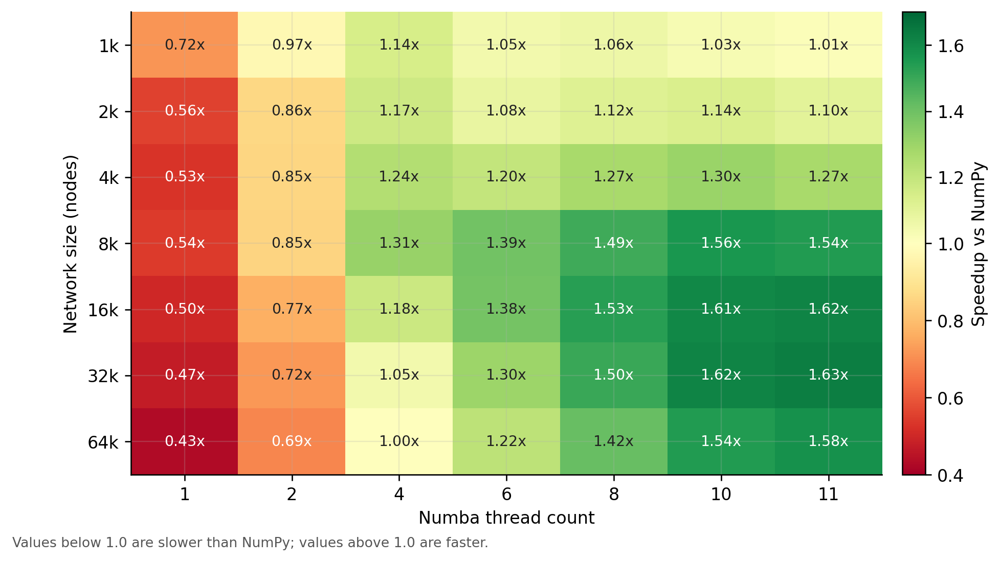
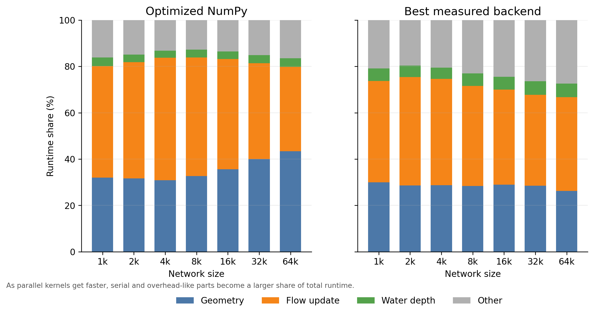

# Choose performance settings

openKARST can run the hydraulic geometry and flow update with either vectorized
NumPy code or optional Numba kernels. The best choice depends mainly on network
size, thread count, and the amount of work per Picard iteration.

Use NumPy as the default for small or exploratory runs. Use Numba parallelization
for larger runs after checking that the selected thread count actually improves
runtime for your model.

## Enable parallelization

```python
solver_settings = {
    "parallelization": True,
    "num_threads": 8,
}

flow = FlowSimulation(network, solver_settings=solver_settings)
```

`num_threads` controls how many Numba worker threads are used. If it is omitted,
Numba chooses its default thread count for the current environment.

## Benchmark-based guideline

The benchmark below compares Numba thread counts against the optimized NumPy
backend for a simple linear network. Values larger than `1.0` mean that the Numba setting
was faster than NumPy; values below `1.0` mean that NumPy was faster.



For this benchmark:

- One or two Numba threads were slower than optimized NumPy.
- Four threads helped for small to medium networks, but only modestly.
- Eight or more threads became useful for larger networks.
- The best speedup was around `1.6x`, not proportional to the number of threads.

A practical rule of thumb is:

| Network size | Suggested starting point |
| --- | --- |
| Small networks | Use NumPy first. Test Numba only if runtime matters. |
| Medium networks | Compare NumPy with `num_threads=4` and `num_threads=8`. |
| Large networks | Try Numba with 8 threads up to the number of physical cores. |
| Batch runs | Avoid giving every simulation all cores if many simulations run at once. |

## Why speedup is limited

Parallelization accelerates only parts of the solver. Other work, such
as serial bookkeeping, conduit-to-node reductions, and memory movement, remains.
As the parallel parts get faster, these other parts become a larger share of total runtime.



The exact crossover point depends on the model. Cave topology, boundary
conditions, geometry backend, output settings, Picard iteration count, and the
machine running the simulation can all change the result. When performance is
important, benchmark a representative simulation with a few thread counts before
choosing final settings.
