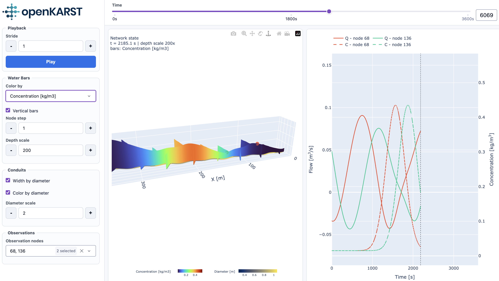

# Use the 3D viewer

openKARST includes a browser-based viewer built with Dash and Plotly. Use it to
inspect transient results, flow rates, water depths, and observation time
series.

## Launch the viewer

```python
from openkarst.visualization.openkarst_viewer import launch_openkarst_viewer

flow.set_observation_points(
    nodes=[0, 19],
    variables=["water_depth", "connected_abs_flowrate", "connected_net_flowrate"],
    interval=1.0,
)

results = flow.run_simulation(desired_outputs=outputs)
obs_df = flow.get_observation_dataframe()

launch_openkarst_viewer(results, network, obs_df)
```

## Keep the process alive

When launching the viewer from a script, keep the Python process alive:

```python
if __name__ == "__main__":
    main()
    input("Viewer running at http://127.0.0.1:8050. Press Enter to stop.")
```


